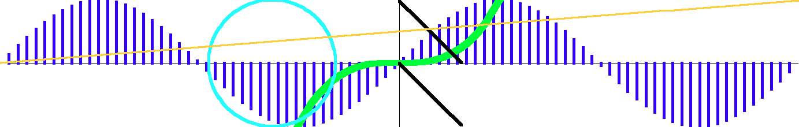

#  PPMP

## What is this?

`PPMP` is a very lightweight c++ plotting library, without any external dependencies. You can do things like:

```c++
#include "ppmp/figure.h"

int main() {
    auto fig = ppmp::PPMFigure::create_proportional(1000);

    auto f = [](ppmp::Real x) { return x * x; };
    fig.plot(f);

    fig.save_canvas("tiny_example");
}
```

That's it! These 10 lines actually compile and produce a `.ppm` image which can be opened by a normal image viewer.
There are absolutely no external dependencies apart from c++ standard library. This library just writes bites to a file
in the Portable Pixel Map (ppm) format, which can be opened and displayed by most image viewing software.

PPMP which stands for ppm-Plotter, is intended for scientists writing simulations. The idea is to have a quick plotting
tool that can help inspect the data during development of the simulation. Something that would otherwise require to first
save the data, then to load and plot it in python.

The goal is not to create a plotting framework that can generate publication grade images, but to short

Currently, `ppmp` can create:
 - Line plots of single argument functions,
 - 2D parametric plots
 - Two data arrays against each other.


## How to get it
`ppmp` Is a header only library, just copy-paste the contents of the `ppmp` folder into your project and include the
headers as needed (or include all the headers).


### Running the demos

Easiest way to run the demo is by using the `bazel` build system by running:
```bash
bazel run //demo:tiny_demo
```
which will compile and run the example code from the beginning of this README.

There is also a larger example demo that uses all currently implemented API's.
```bash
bazel run //demo:demo
```

This run will produce the and example image inside bazels output directory, at:
```
bazel-bin/demo/demo.runfiles/_main/example.ppm
```

Unfortunately github markdown does not render ppm images directly, so the image below was converted to markdown firs.
This is what the above example image looks like when opened by a ppm capable image viewer.



### Other execution methods

`Bazel` is by far the simplest way to execute the demos, but it requires installing `bazel 8.3.0`, or `bazelisk` which
will automatically choose the correct `bazel` version.

The project can also be directly compiled from the command line. However, compiling modern c++ can get ridiculous.

The library uses c++23 features which might lead to problems with old compilers. Here is a list of cpp23
capable compilers:
https://en.cppreference.com/cpp/compiler_support/23

This means that most likely the following compilers (with corresponding standard libraries) will be required: gcc-15,
clang-18, Apple-Clang-16 or MSVC-19.42.


### Examples:

If you are on an operating system with compilers (newer than listed above) then something simple like this might work:
```bash
g++-15 -std=c++23 -I ppmp demo/demo.cpp

```

However, on Ubunty-24.04 or older the default compilers are older and custom installation will be required.

I only tested on Ubunty-24.04 with gcc-15 and clang-18 which I installed through the [Homebrew](https://brew.sh/) package
manager.

#### GCC

First install the newest GCC,

```
brew install gcc
```

In my case this installed gcc-15. Then compile the demo code with:

```bash
g++-15 -std=c++23 -I ppmp demo/demo.cpp -o demogcc -B/home/linuxbrew/.linuxbrew/opt/binutils/bin/

```

The additional `-B` flag specifies the location of the newer assembler.


## Dev area:

### Code Style

```bash
bazel run //:format
```

### Clang-Tidy:

Run clang-tidy on all `ppmp` headers
```bash
bazel test --config=lint //test:figure_test_lint
```

### Coverage
 1. Collect coverage data
```
bazel coverage //test:figure_test
```

 2. Generate HTML report
```
bazel run //:coverage
```
→ coverage_html/index.html


## ToDos:

### Need to do

- Monochromatic heatmap plot for matrices (nested containers?).
- 2d vector-field plot.
- Histogram plot.


### Improvements:

 - When the user requests say 100 points, but the line ends up being mostly outside the canvas, then the number of
   actual points is less than expected 100. It should be arranged that the user specified number of points excludes
   the clipped points.

- Doxygen should be installed with bazel and have a local run target.


### Long-term future

- Simple font for labels and legends
    - Doing generic fonts is out of scope and using a 3rd party dependency defeats the point of this library. Only
      option is to create one simple sprite atlas for ASCII characters and scale them up and down for a given canvas.

- 3D plots with `.stl`

- Terminal canvas
    - ASCII Only.
    - Using special Unicode characters.

### Known Bugs:
- lots of out of bounds writes are attempted (not an error but wasted work)
